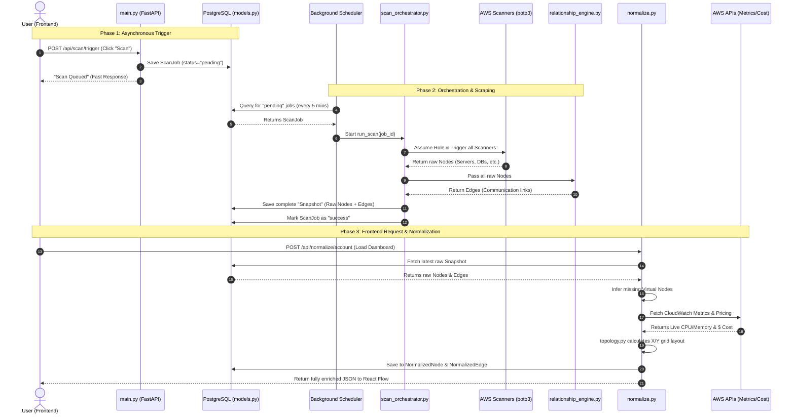

# GravityLens Backend Workflow

Here is the complete step-by-step workflow of how data moves through the GravityLens backend.

## Explanation of Phases

1. **Phase 1: Asynchronous Trigger**: We don't make the user wait while we scan. The API quickly saves a ticket to the database and tells the user "We are working on it."
2. **Phase 2: Orchestration & Scraping**: The background worker wakes up, gathers the raw puzzle pieces from AWS using `boto3`, asks the relationship engine how they connect, and saves the raw snapshot to the vault.
3. **Phase 3: Normalization & Delivery**: When the user actually wants to look at the graph, the Normalizer pulls the raw data from the vault, cleans it up, adds expensive metrics and pricing data, calculates the physical X/Y grid positions, and delivers the final masterpiece to the frontend browser.
