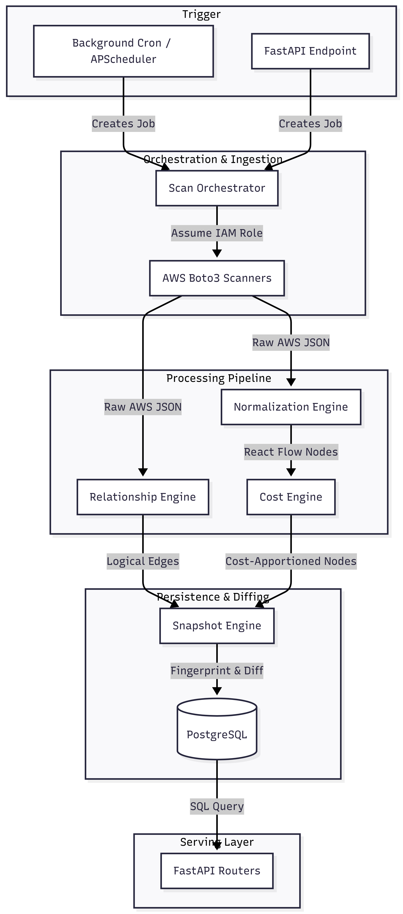

# Backend Architecture Guide

> [!NOTE]
> This document provides a high-level conceptual overview and architectural flow of the Nebula Lens backend. For detailed deep-dives into specific engines, refer to the individual module documentation linked throughout.

## 1. System Core Concepts

Before diving into code, it is critical to understand the foundational patterns and business goals driving the backend architecture:

- **Stateless Ingestion, Stateful History:** The system continuously polls AWS to ingest raw cloud state. Instead of overwriting old data in place, it uses an append-only snapshot model. This enables deterministic "Time Travel" and configuration drift detection for the frontend.
- **Decoupled Data Shapes (Adapter Pattern):** The chaotic, deeply nested JSON returned by AWS Boto3 APIs is explicitly decoupled from the frontend visualization. The backend acts as a massive data adapter, enforcing a strict React Flow schema (`{"id": "...", "type": "...", "data": {...}}`) so the UI doesn't have to parse AWS quirks.
- **Inferred Topology:** AWS does not provide a single, unified graph API for relationships. The backend must infer communication edges (e.g., an EC2 instance talking to an RDS database) by statically analyzing IAM roles, Security Groups, and Event Source Mappings.
- **Deferred Layout Processing:** To conserve backend CPU and memory, the server does not compute mathematical graph layouts (like hierarchical bounding boxes). It simply returns logical edges and containment mapping; the heavy layout lifting is deferred to the client browser (`elkjs`).

*(Cross-references: [Project Inventory](../internal/inventory/project-inventory.md), [Architecture Mapping](../internal/architecture/architecture-mapping.md))*

## 2. High-Level Architecture Flow

The backend operates in two primary modes: asynchronous background scanning (the write path) and real-time REST API serving (the read path).

# Backend Architecture Flow

## 3. Module Implementations

### 3.1. Discovery & Orchestration
**Concept**: Securely assume customer IAM roles via AWS STS and execute parallel pagination across AWS regions. Resiliency is prioritized—if a single AWS service API fails (e.g., rate limit on Lambda), the engine flags a partial failure rather than crashing the entire topology scan.

**Implementation**:
- `backend/app/engines/scan_orchestrator.py`: Manages the lifecycle and state of a `ScanJob`.
- `backend/app/scanners/`: Contains the Boto3 service wrappers.

**Cross-reference**: [Scan Orchestrator Notes](../internal/backend/scan-orchestrator-notes.md), [Discovery Pipeline Notes](../internal/backend/discovery-pipeline-notes.md)

---

### 3.2. Data Normalization
**Concept**: The Adapter layer that converts Boto3 responses into React Flow nodes. Critically, this engine also computes deterministic SHA-256 signatures (fingerprints) based on sorted resource metrics. This fingerprint is later used to detect state drift between snapshots.

**Implementation**:
- `backend/app/engines/normalizer.py`

**Cross-reference**: [Normalization Notes](../internal/backend/normalization-notes.md)

---

### 3.3. Relationship Inference
**Concept**: Since AWS resources are inherently siloed, this engine evaluates metadata to generate high-confidence edges. It resolves parent-child relationships (e.g., Subnet containing an EC2) and runtime connections (e.g., API Gateway routing to Lambda) based on a statically defined ruleset and Security Group IP overlap.

**Implementation**:
- `backend/app/engines/relationship_engine.py`

**Cross-reference**: [Relationship Engine Notes](../internal/backend/relationship-engine-notes.md), [Network Resolution Notes](../internal/backend/network-resolution-engine-notes.md)

---

### 3.4. Cost Allocation
**Concept**: Translates raw infrastructure into financial metrics by querying the AWS Pricing API. It employs complex allocation algorithms, such as distributing the fixed monthly cost of a VPC NAT Gateway proportionally across all subnets based on resource density.

**Implementation**:
- `backend/app/engines/cost_engine.py`
- `backend/app/engines/costs/` (Cost Calculators Registry)

**Cross-reference**: [Cost Engine Notes](../internal/backend/cost-engine-notes.md)

---

### 3.5. Time Travel & Persistence (Snapshotting)
**Concept**: Implements a deep-copy persistence strategy. Instead of saving just the deltas, every scan creates a full database copy of the normalized graph. The engine then diffs the new resource fingerprints against the previous snapshot to calculate exactly what was `added`, `removed`, or `modified`, guaranteeing O(1) read performance for historical dashboards.

**Implementation**:
- `backend/app/engines/snapshot_engine.py`
- `backend/app/database.py`
- `backend/app/models/models.py` (SQLAlchemy schemas)

**Cross-reference**: [Snapshot Engine Notes](../internal/backend/snapshot-engine-notes.md), [Database Notes](../internal/backend/database-notes.md)

---

### 3.6. API & Serving Layer
**Concept**: The FastAPI REST layer exposing topology and historical data to the Next.js frontend. It leverages PostgreSQL indexing (`snapshot_id`, `is_latest`) to quickly filter and serve massive JSON graph payloads.

**Implementation**:
- `backend/app/main.py` (Uvicorn App Entrypoint & APScheduler setup)
- `backend/app/routers/` (Controllers: e.g., `graph.py`, `history.py`)

**Cross-reference**: [API Notes](../internal/backend/api-notes.md), [Backend Notes](../internal/backend/backend-notes.md)
