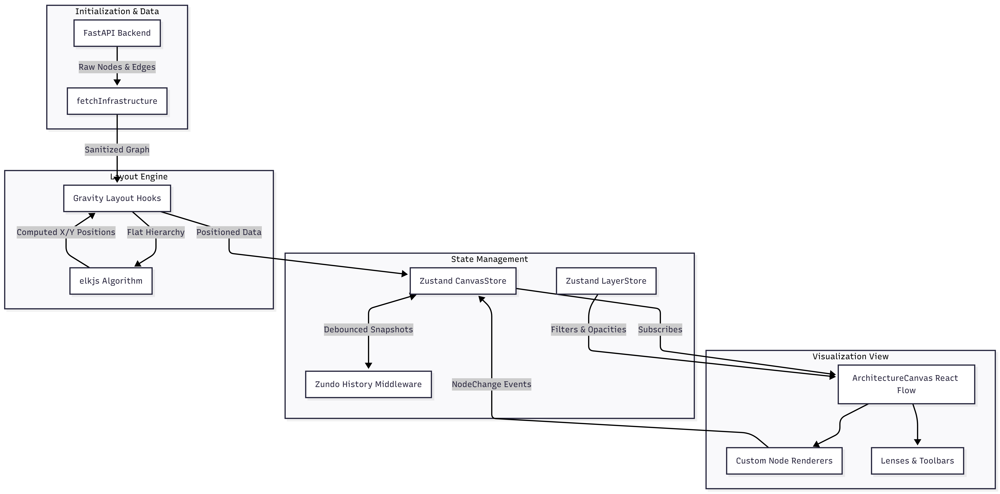

# Frontend Architecture Guide

> [!NOTE]
> This document provides a high-level conceptual overview and architectural flow of the Nebula Lens frontend. For detailed deep-dives into specific engines, refer to the individual module documentation linked throughout.

## 1. System Core Concepts

Before diving into code, it is critical to understand the foundational patterns and business goals driving the frontend architecture:

- **Client-Side Layout Processing:** The backend provides raw, unpositioned nodes and edges. The frontend utilizes `elkjs` to compute complex mathematical graph layouts (like hierarchical bounding boxes) entirely in the browser, keeping the backend highly scalable.
- **Global State Outside React:** The highly volatile state (thousands of nodes, edges, layers, undo history) is managed in Zustand outside of the standard React component hierarchy. This prevents massive re-renders and UI freezing.
- **Layered Visibility (Lenses):** The UI dynamically applies visual overlays ("Lenses") and filters to the architecture without modifying the underlying raw data, enabling immediate views into cost, security, or routing context.
- **Temporal Tracking (Time Travel):** The system tracks structural mutations to the graph using `zundo`, debouncing state snapshots to maintain a history stack for undo/redo actions without excessive memory bloat.

*(Cross-references: [Frontend Notes](../internal/frontend/frontend-notes.md))*

## 2. High-Level Architecture Flow

The frontend operates around a centralized state store that coordinates data fetching, mathematical layout processing, and React Flow visualization rendering.

## 3. Module Implementations

### 3.1. State Management Engine
**Concept**: Manages the highly interactive and volatile frontend state (nodes, edges, lenses) outside of React's standard hierarchy to ensure fluid performance. It acts as the global "source of truth", handling API hydration, temporal history tracking (Undo/Redo via `zundo`), and simulating live telemetry for live stream features.

**Implementation**:
- `src/store/useCanvasStore.ts`
- `src/store/layerStore.ts`

**Cross-reference**: [Frontend Store Notes](../internal/frontend/frontend-store-notes.md)

---

### 3.2. Layout Engine
**Concept**: Translates React Flow's flat node array into a nested compound graph to be processed by the Eclipse Layout Kernel (`elkjs`). It executes the algorithm with specific constraints to cleanly organize hierarchical AWS resources (e.g., placing EC2 instances inside correct Subnets and VPCs). It employs a fallback grid mechanism for unconnected resources to save computation time.

**Implementation**:
- `src/lib/layout/gravityLayout.ts`
- `src/lib/layout/nodeUtils.ts`
- `src/lib/layout/useAutoLayout.ts`

**Cross-reference**: [Layout Engine Notes](../internal/frontend/layout-engine-notes.md)

---

### 3.3. Visualization Module
**Concept**: Acts as the sophisticated React rendering layer over `@xyflow/react`. It maps backend schemas to customized React elements (like `LambdaNode`, `Ec2Node`). It manages smooth geometric interpolation for node transitions, Framer Motion states for UI overlays, and actively processes active lenses to visually dim or highlight resources based on metrics.

**Implementation**:
- `src/components/canvas/` (Core React Flow containers)
- `src/components/nodes/` (Individual AWS resource renderers)
- `src/components/ui/` (Overlays, Lenses, Command Palette)

**Cross-reference**: [Visualization Notes](../internal/frontend/visualization-notes.md)
