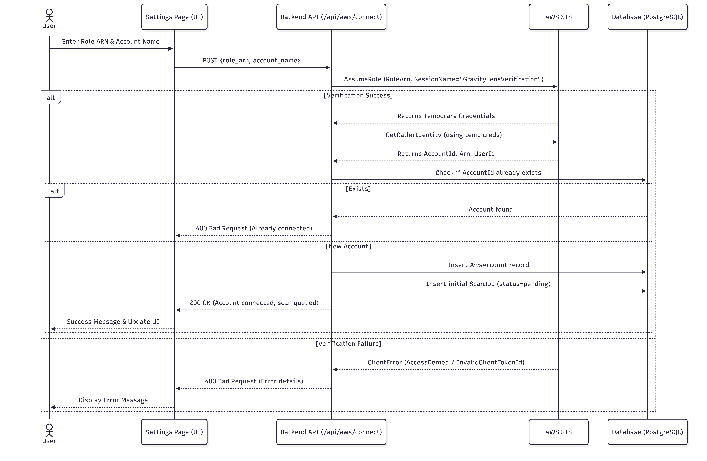

# AWS Account Linking Process

## 1. Overview
The AWS Account Linking Process enables GravityLens to securely connect to a customer's AWS environment for continuous infrastructure discovery and analysis.
To maintain a high security posture, GravityLens does not accept static, long-lived credentials (such as AWS Access Keys). Instead, it relies on cross-account IAM Roles and AWS Security Token Service (STS) to generate temporary, least-privilege credentials on demand.

### Workflow Summary
1. The user creates a read-only IAM Role in their AWS Account.
2. The user provides the Role ARN to GravityLens.
3. GravityLens assumes the role using AWS STS to verify access and generate temporary credentials.
4. Upon successful verification, the account is registered, and an initial infrastructure scan is queued.

## 2. User Prerequisites
Before a user can link their AWS account to GravityLens, the following prerequisites must be met:
- An active AWS Account.
- IAM permissions to create Roles and attach policies (`iam:CreateRole`, `iam:AttachRolePolicy`).
- *(Optional but recommended)* Multi-region deployment requires the regions to be enabled (opt-in status) to allow discovery across the entire AWS footprint.

## 3. IAM Role Creation
The customer must create an IAM role specifically for GravityLens to assume.

### Step-by-Step Console Guide:
1. **Navigate to IAM**: Log in to the AWS Management Console, open the **IAM Console**, navigate to **Roles**, and click **Create role**.
2. **Select Trusted Entity**:
   - Select **AWS account** as the trusted entity type.
   - Under the **An AWS account** section, select the option **Another AWS account** (since GravityLens assumes the role from its central AWS account).
   - Enter the central GravityLens AWS Account ID (provided during onboarding).
3. **Configure Options (External ID)**:
   - Leave the **Require external ID** checkbox **unchecked** (GravityLens does not currently supply an External ID when assuming roles).
4. **Attach Permissions**: Click **Next** and attach the necessary read-only permissions (e.g., `ReadOnlyAccess` or the specific inline permissions shown in [Section 5](#5-permission-policy)).
5. **Name and Create**:
   - **Role Name**: While the exact name is not enforced by the backend (which accepts any valid ARN), the recommended convention is `GravityLens-Scanner-Role`.
   - **Session Duration**: Standard 1-hour STS session duration (default).
   - Click **Create role**.

> [!NOTE]
> **Regarding AWS Account ID `618642320905`**:
> You may notice this Account ID in frontend placeholders (e.g., `SettingsPage.tsx`) and mock architecture files (`architecture.json`). This ID is used strictly for **UI illustration and mocked testing**; it is not a hardcoded dependency in the production authentication flow. In production, this value is replaced by the customer's actual AWS Account ID or the central GravityLens AWS Account ID depending on the context.

## 4. Trust Policy (AssumeRole Policy)
The trust relationship dictates *who* can assume the role. The customer must configure the trust policy to allow the central GravityLens AWS Account to assume it.

```json
{
  "Version": "2012-10-17",
  "Statement": [
    {
      "Effect": "Allow",
      "Principal": {
        "AWS": "arn:aws:iam::YOUR_GRAVITYLENS_ACCOUNT_ID:root"
      },
      "Action": "sts:AssumeRole"
    }
  ]
}
```
### Field Breakdown:
- **Principal**: Specifies the trusted entity, which is the root of the central GravityLens AWS Account.
- **Action (`sts:AssumeRole`)**: Grants the STS service permission to issue temporary security credentials.

## 5. Permission Policy
To perform discovery without mutating customer infrastructure, the role requires read-only permissions to the following services:

| Service | Permissions | Purpose |
|---------|-------------|---------|
| **EC2 / VPC** | `ec2:DescribeInstances`, `ec2:DescribeSecurityGroups`, `ec2:DescribeVpcs`, `ec2:DescribeSubnets` | Discover compute instances, network topology, subnets, and security groups. |
| **RDS** | `rds:DescribeDBInstances`, `rds:DescribeDBClusters` | Identify relational databases, engine types, and storage configurations. |
| **S3** | `s3:ListBucket`, `s3:GetBucketLocation`, `s3:GetBucketVersioning` | List storage buckets and extract metadata (e.g., versioning status, region). |
| **SQS** | `sqs:ListQueues`, `sqs:GetQueueAttributes` | Map message queues and their configurations. |
| **Lambda** | `lambda:ListFunctions`, `lambda:GetFunction` | Discover serverless functions, runtimes, memory allocations, and environment setups. |
| **API Gateway** | `apigateway:GET` | Discover API endpoints and integrations. |

## 6. Linking Workflow



## 7. Backend Processing
The core linking logic is implemented in the FastAPI backend:

- **API Endpoint**: `POST /api/aws/connect` (`backend/app/routers/aws_accounts.py`)
- **Service Layer**: `AWSService.verify_role_arn` (`backend/app/services/aws_service.py`)

### Processing Steps:
1. **Verification**: The API receives the Role ARN and passes it to `aws_service.verify_role_arn()`.
2. **STS Assume Role**: The backend instantiates an STS client and calls `assume_role(RoleArn, RoleSessionName="GravityLensVerification")`.
3. **Identity Confirmation**: Using the returned temporary credentials, it calls `get_caller_identity()` to reliably extract the customer's AWS Account ID.
4. **Database Registration**:
   - Queries `AwsAccount` to prevent duplicate linkages.
   - If unique, creates a new `AwsAccount` record associating the `account_id`, `role_arn`, and the `user_id`.
5. **Scan Trigger**: An initial `ScanJob` is inserted with `status=pending` and `triggered_by="initial_connect"`, allowing the asynchronous discovery pipeline to pick it up.

## 8. Security Considerations
- **No Long-Lived Credentials**: By utilizing IAM roles and STS, GravityLens never stores permanent access keys, minimizing the blast radius in the event of a breach.
- **Confused Deputy Protection**: *(Future Roadmap)* Support for `ExternalId` condition configuration is planned to prevent the Confused Deputy Problem in multi-tenant environments.
- **Principle of Least Privilege**: The requested permissions strictly use `Describe*`, `List*`, and `Get*` actions. The platform cannot create, modify, or delete customer resources.
- **Session Expiration**: STS tokens expire (default 1 hour). If a scan exceeds this time, or for subsequent scans, a fresh token is requested.
- **Revoking Access**: The customer maintains ultimate control. They can instantly revoke GravityLens's access by deleting the IAM Role or modifying the trust policy from their AWS Console.

## 9. Failure Scenarios

| Failure Scenario | Cause | Detection Mechanism | User-Visible Error | Resolution |
|-----------------|-------|----------------------|--------------------|------------|
| **Invalid ARN Format** | User typed the ARN incorrectly or it points to a non-existent role. | STS `AssumeRole` throws `InvalidClientTokenId`. | "Invalid credentials. Check your Role ARN." | Ensure the ARN matches exactly what is in the AWS IAM Console. |
| **Trust Relationship Missing/Incorrect** | Principal is wrong, or external ID is configured but unsupported. | STS `AssumeRole` throws `AccessDenied`. | "Access denied. Check your IAM Role permissions." | Verify the Trust Policy has the correct Principal and does not require an `ExternalId` (uncheck the "Require external ID" option in the AWS Console). |
| **Missing Permissions** | Role assumed successfully, but lacks permissions to describe resources. | Boto3 clients (EC2, RDS, etc.) throw `AccessDenied` during the scan phase. | *Implementation not verified (Scan fails silently or logs error in discovery pipeline)*. | Attach the `ReadOnlyAccess` policy or the precise inline permissions. |
| **Account Already Connected** | User attempts to link an account that is already in the database. | Backend queries `AwsAccount` by Account ID and finds a match. | "AWS Account {account_id} is already connected." | Manage the existing connection instead of creating a new one. |

## 10. Troubleshooting

### Issue: "Access denied. Check your IAM Role permissions."
- **Cause**: The GravityLens central account is not permitted to assume the role. This usually means the Trust Policy is misconfigured.
- **Diagnostic Steps**:
  1. Open the IAM Role in the AWS Console.
  2. Navigate to the "Trust relationships" tab.
  3. Verify the Principal matches the GravityLens central AWS Account ID.
  4. Verify that "Require external ID" is **not** checked, and the Trust Policy does not contain an `sts:ExternalId` condition block.
- **Resolution**: Update the Trust Policy JSON to match the provided template.

### Issue: "Invalid credentials. Check your Role ARN."
- **Cause**: The provided string is not a valid IAM Role ARN.
- **Diagnostic Steps**: Ensure the string follows the format `arn:aws:iam::<Account_ID>:role/<Role_Name>`.
- **Resolution**: Copy the exact Role ARN from the AWS IAM Console summary page.

### Issue: Account links successfully, but scan discovers zero resources
- **Cause**: The IAM role lacks permissions (e.g., `ec2:DescribeInstances`), or resources are deployed in an AWS Region that the backend is not querying.
- **Diagnostic Steps**:
  1. Check the IAM Role's attached permission policies.
  2. Check backend logs for Boto3 `AccessDeniedException` errors.
  3. Verify the resources exist in regions queried by `AWSService.get_active_regions()`.
- **Resolution**: Attach the correct permission policies. Ensure the active regions are correctly opted-in.

## 11. Architecture Notes & References
The Account Linking Process intersects with several other backend components:
- **Discovery Pipeline**: After linking, the `ScanJob` is created. Refer to [Discovery Pipeline Notes](./discovery-pipeline-notes.md) for how `scan_orchestrator.py` picks up this job.
- **Database**: The account is stored in the `aws_accounts` table. Refer to [Database Notes](./database-notes.md) for schema details.
- **API Endpoints**: Detailed in [API Notes](./api-notes.md) and handled in `aws_accounts.py`.

---
*Target Audience: Backend Engineers, DevOps Engineers, and Advanced Users.*
